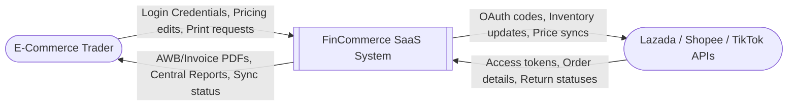
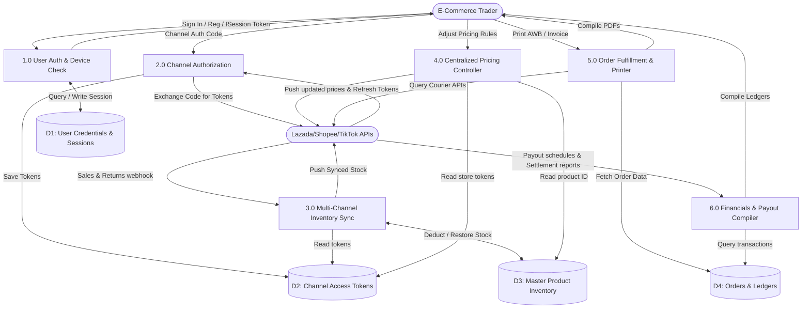

# Data Flow Diagram (DFD) - FinCommerce v1.0

This document outlines the Data Flow Diagram (DFD) for the FinCommerce multi-channel e-commerce integration SaaS.

---

## 1. DFD Level 0 (Context Diagram)

The Context Diagram defines the system boundary and interfaces with external actors:

### DFD Level 0 Data Flow Descriptions

| Flow Name | Source | Destination | Description |
|:---|:---|:---|:---|
| **Credentials & Request** | E-Commerce Trader | FinCommerce | Merchant credentials, search parameters, print triggers, manual inventory adjustments. |
| **Merchant Output** | FinCommerce | E-Commerce Trader | Dynamic dashboards, compiled AWB/Invoice PDFs, sales reports. |
| **API Synchronizations** | FinCommerce | Channel APIs | Outbound API requests pushing master stock levels, promotional price updates, and listings. |
| **Channel Status Alerts** | Channel APIs | FinCommerce | Inbound webhook events notifying the system of new sales, cancellations, returns, and payout data. |

---

## 2. DFD Level 1 (Process Decomposition Diagram)

The Level 1 DFD decomposes the system into core sub-processes, tracking data movements into persistent database stores:

### DFD Level 1 Process Catalog

#### Process 1.0: User Account Authentication & Security Check
* **Inputs**: Credentials (Email/Phone + Password), SMS OTP code, Biometric tokens, session revocation request.
* **Outputs**: Auth session cookie, security warnings, device console lists.
* **Target Store**: `D1: User Credentials & Sessions`

#### Process 2.0: Multi-Channel Platform Authorization (OAuth)
* **Inputs**: Temporary OAuth code from Shopee/Lazada/TikTok redirects.
* **Outputs**: Secure OAuth tokens.
* **Target Store**: `D2: Channel Access Tokens`

#### Process 3.0: Centralized Inventory Synchronization
* **Inputs**: Webhook order alerts, return approvals.
* **Outputs**: Pushed stock level updates across other platforms.
* **Target Store**: `D3: Master Product Inventory`

#### Process 4.0: Centralized Pricing Controller
* **Inputs**: Price change triggers, campaign rules, competitor calculations.
* **Outputs**: Pushed prices.
* **Target Store**: `D3: Master Product Inventory`

#### Process 5.0: Order Fulfillment & Printer
* **Inputs**: Multi-channel printing trigger.
* **Outputs**: Combined AWB, Picklist, Invoice PDF document.
* **Target Store**: `D4: Orders & Ledgers`

#### Process 6.0: Financials & Payout Compiler
* **Inputs**: Channel settlements, commissions.
* **Outputs**: Centralized monthly/weekly payout ledger charts.
* **Target Store**: `D4: Orders & Ledgers`
