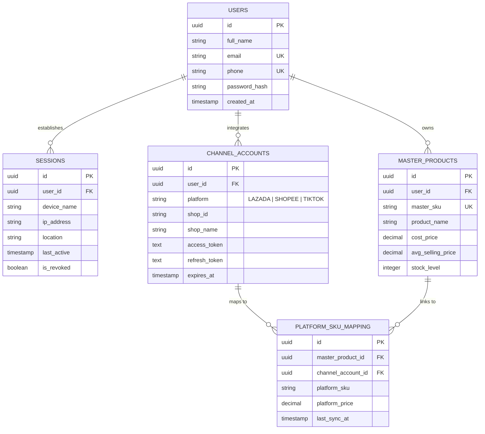

# Entity Relationship Diagram (ERD) - FinCommerce v1.0

This document defines the relational database model, keys, data types, constraints, and table schemas for the FinCommerce SaaS application.

---

## 1. Entity Relationship Diagram (ERD)

---

## 2. Table Data Dictionary

### 2.1 Table: `USERS`
Stores master credentials for merchants logging into the FinCommerce portal.

| Field Name | Data Type | Keys | Constraints | Description |
|:---|:---|:---:|:---|:---|
| **id** | UUID | PK | NOT NULL, DEFAULT gen_random_uuid() | Unique identifier for each merchant account. |
| **full_name** | VARCHAR(120) | - | NOT NULL | User's full name. |
| **email** | VARCHAR(255) | UK | NOT NULL, UNIQUE | Primary login email address. |
| **phone** | VARCHAR(20) | UK | NOT NULL, UNIQUE | Mobile phone number used for SMS OTP and recovery. |
| **password_hash**| VARCHAR(255) | - | NOT NULL | Secure salted password hash (e.g., Argon2id). |
| **created_at** | TIMESTAMP | - | NOT NULL, DEFAULT NOW() | Record creation date. |

### 2.2 Table: `SESSIONS`
Tracks active and remote logins for the Smart Device Management console.

| Field Name | Data Type | Keys | Constraints | Description |
|:---|:---|:---:|:---|:---|
| **id** | UUID | PK | NOT NULL | Session identifier. |
| **user_id** | UUID | FK | NOT NULL, REFERENCES USERS(id) | Linked merchant owner. |
| **device_name** | VARCHAR(100) | - | NOT NULL | Browser and OS description (e.g. "Safari on iOS"). |
| **ip_address** | VARCHAR(45) | - | NOT NULL | Logged IPv4 or IPv6 address. |
| **location** | VARCHAR(100) | - | NOT NULL | Geolocation coordinate city/country. |
| **last_active** | TIMESTAMP | - | NOT NULL | Last action active timestamp. |
| **is_revoked** | BOOLEAN | - | NOT NULL, DEFAULT FALSE | State flag. If TRUE, session is forced signed out. |

### 2.3 Table: `CHANNEL_ACCOUNTS`
Maintains e-commerce API OAuth authentication scopes and tokens.

| Field Name | Data Type | Keys | Constraints | Description |
|:---|:---|:---:|:---|:---|
| **id** | UUID | PK | NOT NULL | Store channel ID. |
| **user_id** | UUID | FK | NOT NULL, REFERENCES USERS(id) | Merchant owner. |
| **platform** | VARCHAR(20) | - | NOT NULL (LAZADA / SHOPEE / TIKTOK) | E-commerce channel identity. |
| **shop_id** | VARCHAR(50) | - | NOT NULL | Platform assigned Seller ID. |
| **shop_name** | VARCHAR(100) | - | NOT NULL | Profile display store name. |
| **access_token** | TEXT | - | NOT NULL | OAuth access token. |
| **refresh_token**| TEXT | - | NOT NULL | OAuth refresh token. |
| **expires_at** | TIMESTAMP | - | NOT NULL | Token expiration date. |

### 2.4 Table: `MASTER_PRODUCTS`
Centralized inventory products mapping to physical warehouse shelf stocks.

| Field Name | Data Type | Keys | Constraints | Description |
|:---|:---|:---:|:---|:---|
| **id** | UUID | PK | NOT NULL | Product ID. |
| **user_id** | UUID | FK | NOT NULL, REFERENCES USERS(id) | Merchant owner. |
| **master_sku** | VARCHAR(100) | UK | NOT NULL, UNIQUE | Central SKU identifier (e.g. "FIN-100-RED"). |
| **product_name** | VARCHAR(200) | - | NOT NULL | Product title. |
| **cost_price** | DECIMAL(10,2) | - | NOT NULL, >= 0.00 | Cost pricing. |
| **avg_selling_price**| DECIMAL(10,2)| - | NOT NULL, >= 0.00 | Average selling price across platform nodes. |
| **stock_level** | INTEGER | - | NOT NULL, DEFAULT 0, >= 0 | Actual physical inventory quantity available. |

### 2.5 Table: `PLATFORM_SKU_MAPPING`
Links Lazada, Shopee, and TikTok Shop store SKUs to our central master stock catalog.

| Field Name | Data Type | Keys | Constraints | Description |
|:---|:---|:---:|:---|:---|
| **id** | UUID | PK | NOT NULL | Mapping ID. |
| **master_product_id**| UUID | FK | REFERENCES MASTER_PRODUCTS(id) | Reference to master inventory record. |
| **channel_account_id**| UUID | FK | REFERENCES CHANNEL_ACCOUNTS(id) | Reference to platform store account. |
| **platform_sku** | VARCHAR(100) | - | NOT NULL | Store-specific SKU label (e.g. "LZD-100-RED"). |
| **platform_price**| DECIMAL(10,2)| - | NOT NULL | Set price active on the channel. |
| **last_sync_at** | TIMESTAMP | - | NOT NULL | Last synchronization datetime stamp. |
