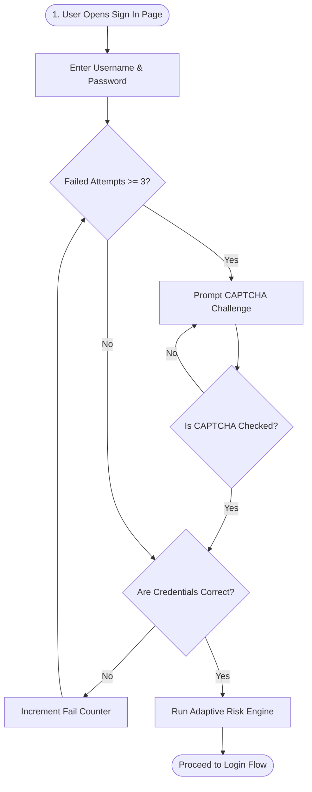
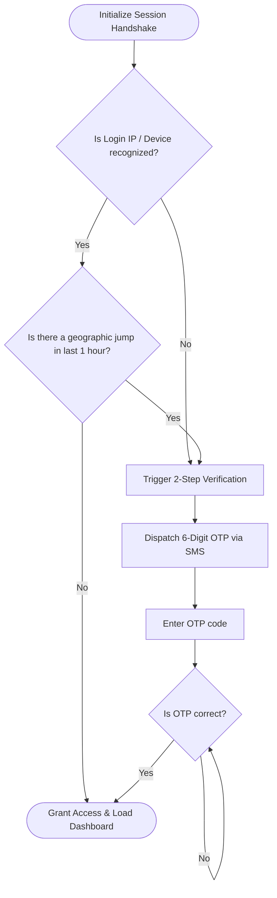
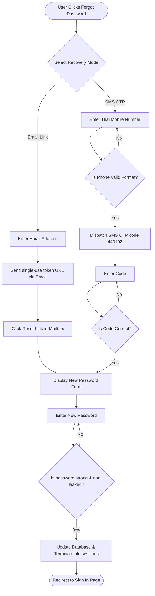
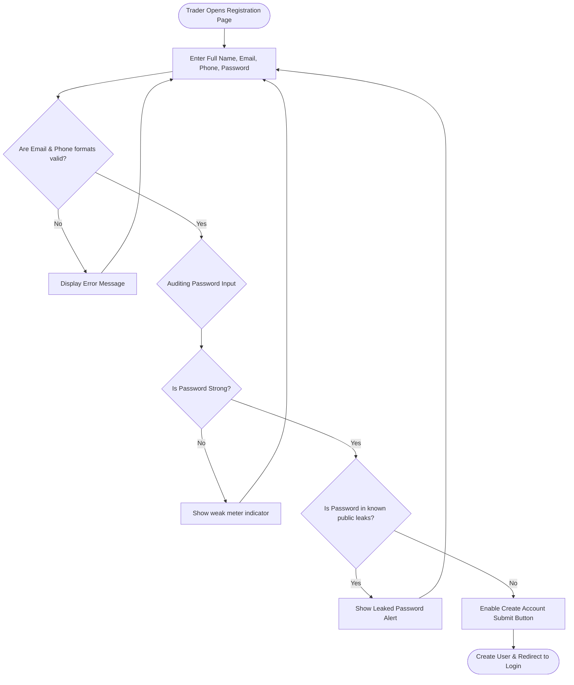

# Flowcharts - FinCommerce Security & Recovery Pipelines

This document provides flowcharts mapping critical user entrypoints, security checks, and password recovery states in FinCommerce.

---

## 1. User Sign In & Rate Limiting Flowchart

Details authentication gates, failure counting, and CAPTCHA lockout thresholds:

---

## 2. Adaptive Risk-Based Authentication Flowchart

Maps silent geolocation checks and SMS OTP secondary verification challenges:

---

## 3. Self-Service Account Recovery Flowchart

Outlines SMS verification and Email-based recovery flows:

---

## 4. Account Registration Input Validation Flowchart

Maps real-time regex formats and credentials leak checking:

