# Sequence Diagrams - FinCommerce Integration Workflows

This document outlines sequence flows mapping event order, timelines, and communications between users, systems, database layers, and regional e-commerce channels.

---

## 1. Social OAuth Login & Profile Autofill Sequence

This sequence maps the cross-window messaging events that occur when a user authenticates using Google, Facebook, or TikTok:

```mermaid
sequenceDiagram
    autonumber
    actor Trader as Merchant / Trader
    participant Page as Login/Register Page
    participant Popup as oauth_mock.html (Popup)
    participant Server as FastAPI Server
    participant IDP as Social Identity Provider (API)

    Trader->>Page: Click "G" (Google Sign-In)
    Page->>Page: Open oauth_mock.html as centered popup
    Page->>Popup: Load popup window (provider=google)
    Popup->>IDP: Request auth profiles
    IDP-->>Popup: Return user profile choices
    Popup->>Trader: Render profile selections list
    Trader->>Popup: Click on Somchai Dev profile card
    Popup->>Page: window.opener.postMessage({status: SUCCESS, provider: google, email, name}, '*')
    Note over Page,Popup: Secure cross-window handshake
    Popup->>Popup: window.close()
    
    rect rgb(30, 41, 59)
        Note over Page: Handle message event
        Page->>Page: Render connected badge, prefill Email/Name
        Page->>Server: POST /api/v1/auth/login (socialSessionActive = true)
        Server->>Server: Save user details & audit session security
        Server-->>Page: Return JWT token & active session ID
    end
    
    Page->>Trader: Redirect to Dashboard console / log in success
```

### Flow Step Descriptions (OAuth Integration)
1. **Trigger**: Merchant clicks Google/Facebook/TikTok icon on the login or registration forms.
2. **Popup Launch**: The parent window launches a popup client displaying provider templates.
3. **Choice Selection**: Merchant selects their social identity.
4. **Cross-Window Handshake**: The child popup dispatches details to the parent page via HTML5 `postMessage` protocol, then terminates.
5. **Autofill / Auto-Submit**: The parent page parses data, autofills fields, and submits payload parameters directly to the FastAPI server.
6. **JWT Handshake**: FastAPI checks sessions, generates tokens, and registers the session details in the PostgreSQL database.

---

## 2. Multi-Channel Inventory Synchronization Sequence

This sequence maps how stock changes propagate across Shopee, Lazada, and TikTok Thailand in under 5 seconds:

```mermaid
sequenceDiagram
    autonumber
    participant Shopee as Shopee Open API
    participant Server as FastAPI App
    participant Redis as Redis Sync Queue
    participant Worker as Celery Sync Worker
    participant DB as Postgres DB
    participant Lazada as Lazada Open API
    participant TikTok as TikTok Shop API

    Shopee->>Server: Inbound Sales Webhook: Order placed (Stock -1)
    Server->>DB: Fetch channel mappings (Shopee SKU SH-456 => Master SKU FIN-123)
    DB-->>Server: Return Master Product ID
    
    Server->>DB: Lock row & Deduct physical stock locally
    DB-->>Server: Local stock updated
    
    Server->>Redis: Enqueue Sync Jobs (Master SKU FIN-123, new stock level)
    Server-->>Shopee: HTTP 200 OK (AcknowledgeWebhook)
    
    Note over Redis,Worker: Worker pulls job asynchronously
    Worker->>Redis: Fetch next sync job
    Redis-->>Worker: Return sync parameters
    
    Worker->>DB: Query Channel Tokens for Lazada & TikTok
    DB-->>Worker: Return access tokens
    
    rect rgb(30, 41, 59)
        Note over Worker,Lazada: Parallel stock updates execution
        Worker->>Lazada: PUT /product/stock (Lazada SKU LZ-123, stock level)
        Worker->>TikTok: PUT /product/stock (TikTok SKU TT-123, stock level)
        Lazada-->>Worker: Sync Success
        TikTok-->>Worker: Sync Success
    end
    
    Worker->>DB: Log sync transaction status (SUCCESS)
```

### Flow Step Descriptions (Inventory Sync)
1. **Platform Purchase Event**: A customer purchases an item on Shopee. Shopee sends an order webhook to FinCommerce.
2. **Master SKU Resolution**: FinCommerce translates the Shopee SKU to the central Master SKU `FIN-123` via database lookups.
3. **Database Ledger Update**: The FastAPI backend deducts physical stock locally in the PostgreSQL database.
4. **Queue Push**: FastAPI registers task details on Redis, decoupling long-running external API integrations from the primary database transaction.
5. **Worker Integration**: Background worker threads read Redis, pull channel tokens from the database, and execute parallel stock adjustments to Lazada and TikTok Open APIs.
