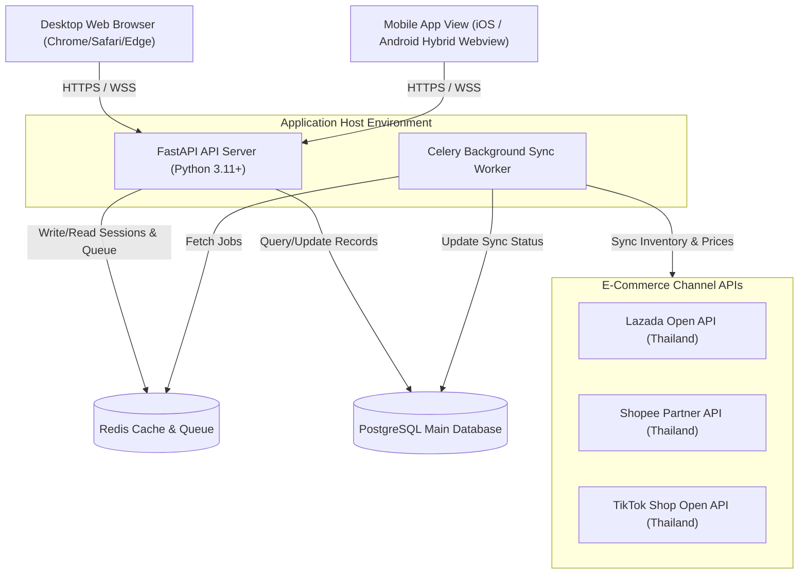
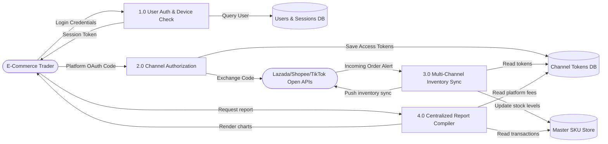
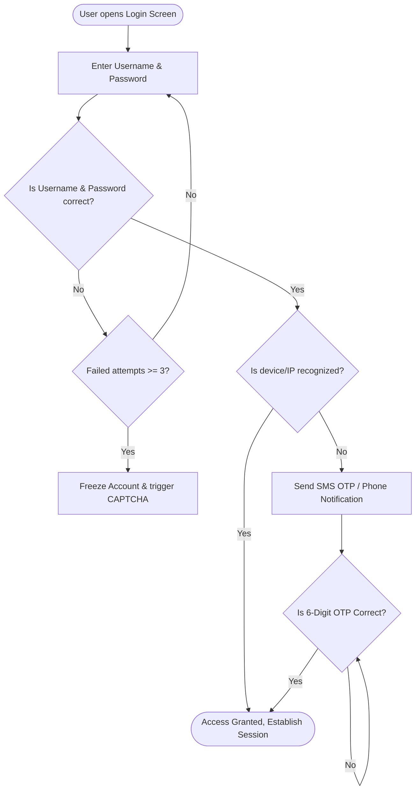

# Technical Specification Design - FinCommerce

This document provides the system architecture, database structure, data flow mappings, and technical integration specifications for FinCommerce.

---

## 1. System Architecture Diagram



---

## 2. Use Case Diagram

```mermaid
left_to_right_direction
actor Trader as "Merchant / Trader"

rectangle FinCommerce {
    usecase UC_Login as "Authenticate (Email/Phone + OTP/Biometric)"
    usecase UC_Register as "Register Account (with Breach Check)"
    usecase UC_Device as "Manage Connected Devices"
    usecase UC_Auth as "Connect Platforms (Lazada/Shopee/TikTok)"
    usecase UC_Sync as "Sync Inventory and Price"
    usecase UC_Print as "Print AWB/Invoice (Bulk)"
    usecase UC_Calc as "Calculate Competition Pricing"
}

Trader --> UC_Register
Trader --> UC_Login
Trader --> UC_Device
Trader --> UC_Auth
Trader --> UC_Sync
Trader --> UC_Print
Trader --> UC_Calc
```

---

## 3. Data Flow Diagram (DFD Level 1)



---

## 4. Database Schema Design (SQL DDL Representation)

### `users`
* `id` (UUID, Primary Key)
* `full_name` (VARCHAR)
* `email` (VARCHAR, Unique)
* `phone` (VARCHAR, Unique)
* `password_hash` (VARCHAR)
* `created_at` (TIMESTAMP)

### `sessions`
* `id` (UUID, Primary Key)
* `user_id` (UUID, Foreign Key references `users.id`)
* `device_name` (VARCHAR)  -- e.g. "iPhone 15 Pro (Safari)"
* `ip_address` (VARCHAR)
* `location` (VARCHAR)     -- e.g. "Bangkok, Thailand"
* `last_active` (TIMESTAMP)
* `is_revoked` (BOOLEAN)

### `channel_accounts`
* `id` (UUID, Primary Key)
* `user_id` (UUID, Foreign Key references `users.id`)
* `platform` (VARCHAR)     -- "LAZADA", "SHOPEE", "TIKTOK"
* `shop_id` (VARCHAR)
* `shop_name` (VARCHAR)
* `access_token` (TEXT)
* `refresh_token` (TEXT)
* `expires_at` (TIMESTAMP)

### `master_products`
* `id` (UUID, Primary Key)
* `user_id` (UUID, Foreign Key references `users.id`)
* `master_sku` (VARCHAR, Unique)
* `product_name` (VARCHAR)
* `cost_price` (DECIMAL)
* `avg_selling_price` (DECIMAL)
* `stock_level` (INTEGER)

### `platform_sku_mapping`
* `id` (UUID, Primary Key)
* `master_product_id` (UUID, Foreign Key references `master_products.id`)
* `channel_account_id` (UUID, Foreign Key references `channel_accounts.id`)
* `platform_sku` (VARCHAR)
* `platform_price` (DECIMAL)
* `last_sync_at` (TIMESTAMP)

---

## 5. Flowchart: Security Login & Adaptive Verification


